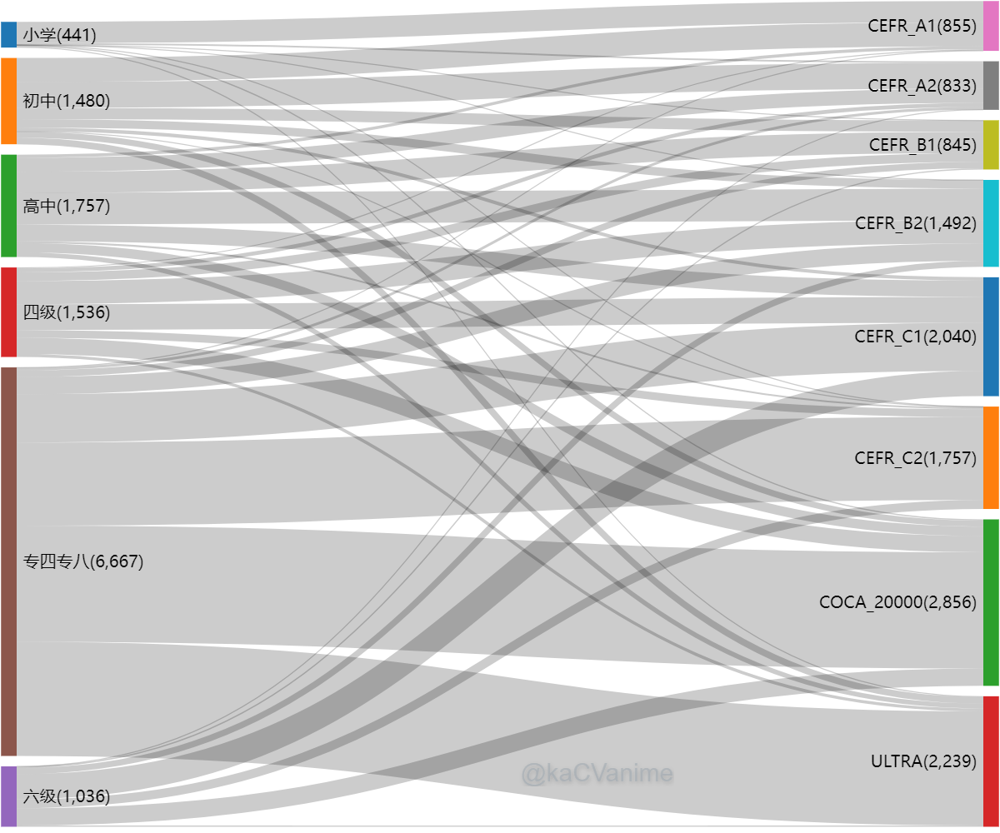
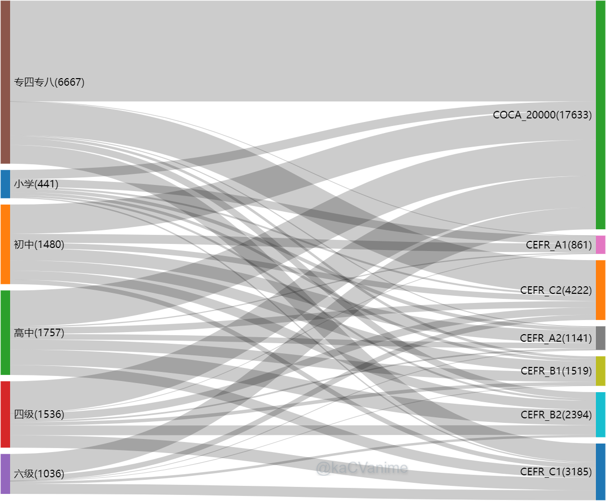

### 国内各等级英语考试与国外的CEFR的关系

--- 

### 国内各考试的词汇在国外各等级中的分布
> 想学国内某一等级(例如四级)，应该学到国外哪一等级？  

> _实现：为国内的各等级，顺着国外等级(由低到高)依次找交集，每次删减。都没找到则放进ULTRA_

---

### 国外各等级之间相比，对国内各等级词汇的覆盖情况
> 单学国外某等级，相当于国内综合实力为？

> _实现：为国内的各等级，顺着在国外等级(由低到高)依次找交集，不删减_

---

#### 目录结构
**origin**  
[此项目](https://github.com/mahavivo/english-wordlists)中的原始cn词表  
**assets**
1. 从各原始cn词表提取词头，并相互删减，使得没有交集  
2. COCA_20000。去重的COCA20000词频  
3. CEFR A1-C2。 以COCA20000为基础在牛津10辞典中提取  
4. ULTRA。国内要求但国外不要求的词。大部分为专四专八，少量极其普遍的词或变形词

