##
此项目目的为解答以下问题
> 国内各级英语应试，能否按照国外的英语水平标准(CEFR)来逐级学习单词

**省流**：不能，重合度不大

## venn

**小学 VS CEFR A1**  
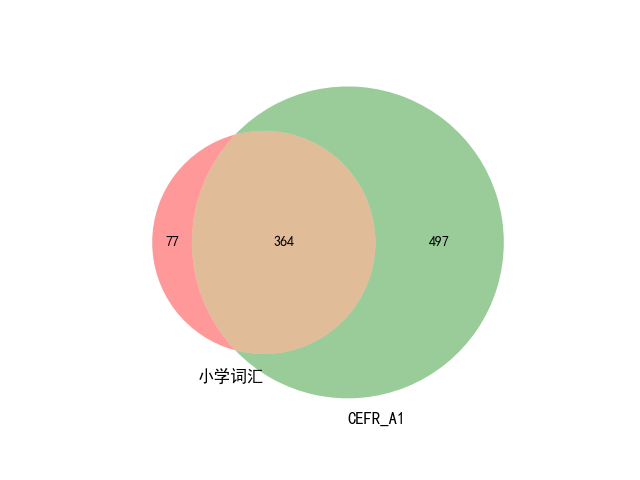
**小学 VS CEFR A2**  
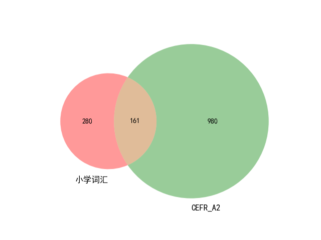
**小学 VS CEFR B2**  
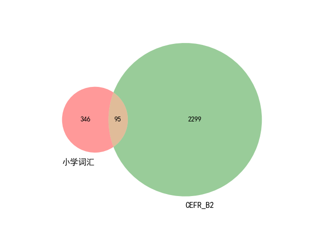

---

**初中 VS CEFR A2**  
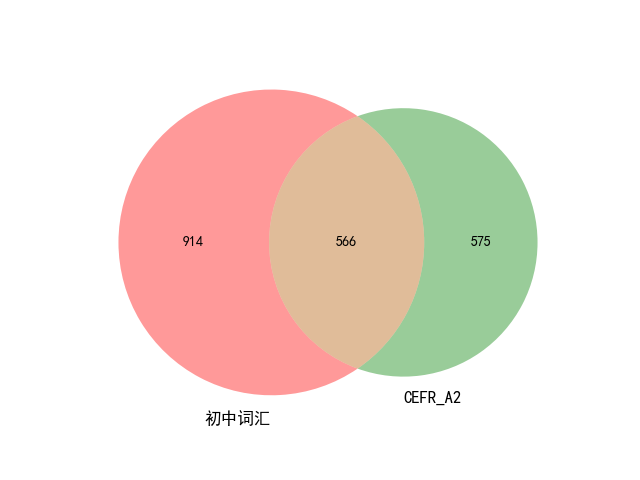
**初中 VS CEFR B1**  
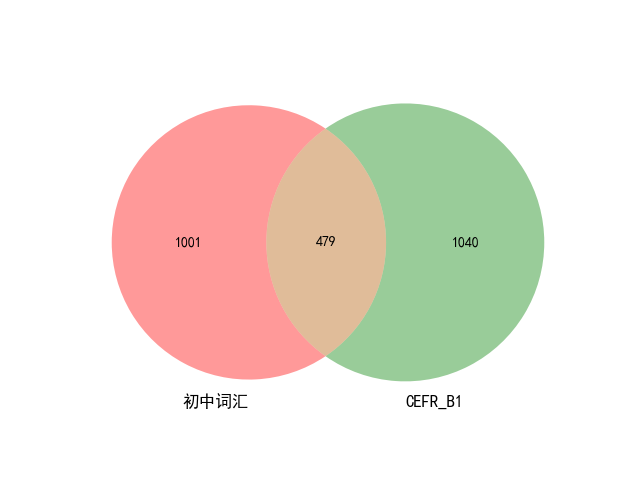
**初中 VS CEFR B2**  
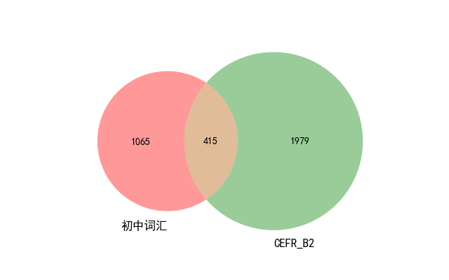

---

**高中 VS CEFR B1**  
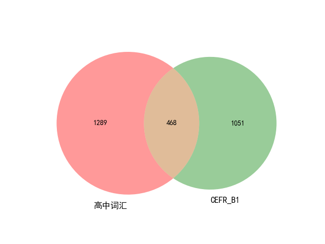

---

**四级 VS CEFR B1**  
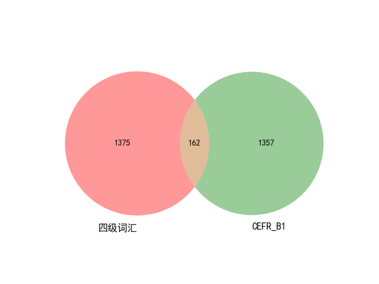
**四级 VS CEFR B2**  
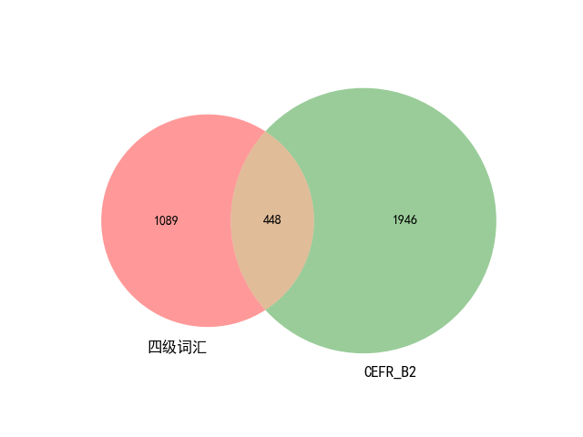

---

**六级 VS CEFR B2**  
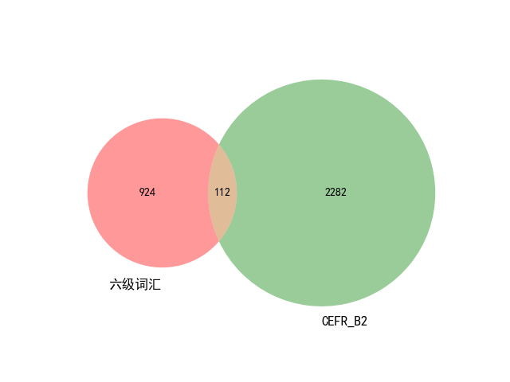

--- 
**专四专八 VS CEFR C1_C2**  
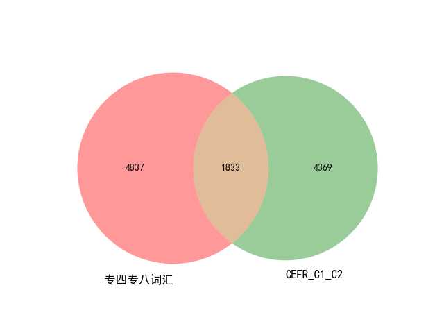

### 项目结构
**/origin**  
[此项目](https://github.com/mahavivo/english-wordlists)整理的各词表  
并修正几处微小错误  
**/assets**  
从原始词表中提取词头，并做去重处理使得各级间不重复  
**/scripts**  
脚本

_CEFR数据来源于牛津10，一个词条下面各释义的CEFR级别，各级间不做去重_
